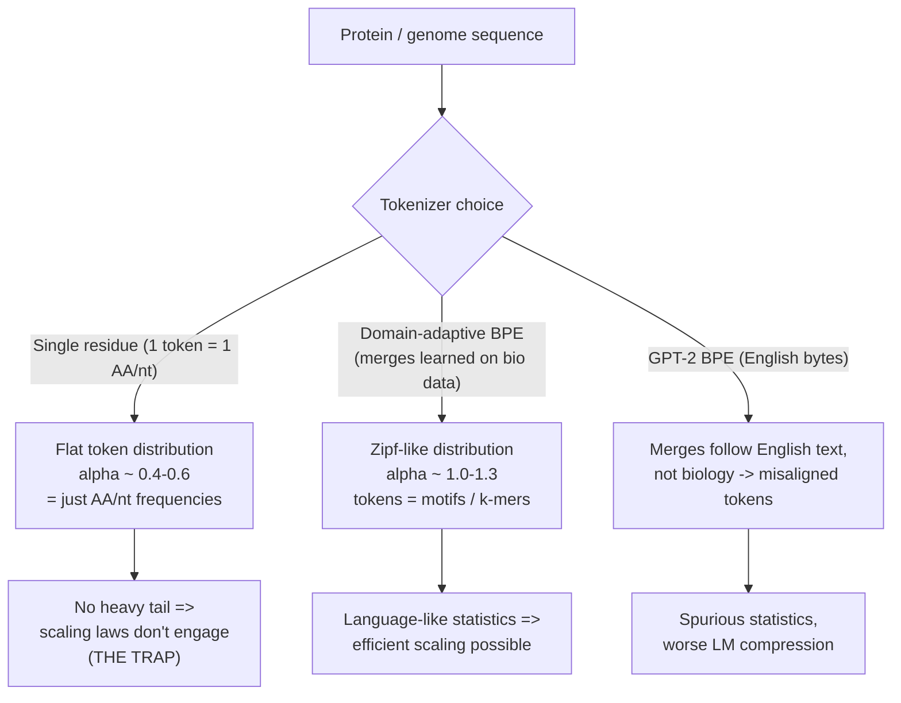
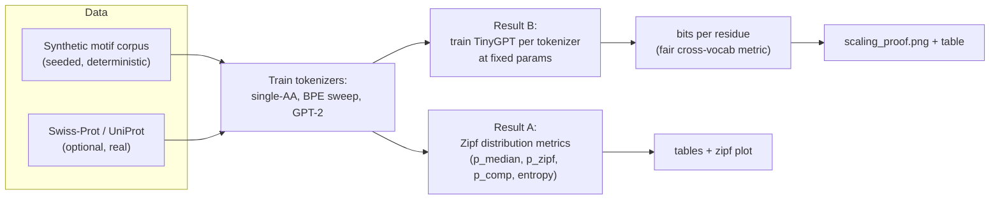
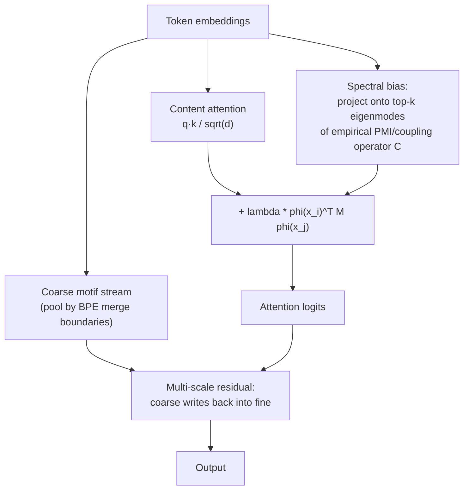

# BPE — Optimal Tokenization for Protein & Genome Language Models

**Thesis:** protein and genome language models don't scale like LLMs because the
*tokenizer* is wrong, not (only) the architecture. Single-residue tokenization
produces flat, non-Zipfian token statistics that starve the scaling laws that
make LLMs work. Domain-adaptive BPE restores a language-like token distribution
and trains measurably better at a fixed parameter budget. GPT-2's English BPE
does **not** transfer.

---

## Table of contents

1. [The core idea (the "tokenization trap")](#1-the-core-idea-the-tokenization-trap)
2. [Why Zipf statistics gate scaling](#2-why-zipf-statistics-gate-scaling)
3. [Experiment pipeline](#3-experiment-pipeline)
4. [Result A — token distribution (Zipf) tables](#4-result-a--token-distribution-zipf-tables)
5. [Result B — the scaling proof (bits per residue)](#5-result-b--the-scaling-proof-bits-per-residue)
6. [Key findings, including the GPT-2 paradox](#6-key-findings-including-the-gpt-2-paradox)
7. [Reproducibility note: why the tables drifted from the screenshots](#7-reproducibility-note-why-the-tables-drifted-from-the-screenshots)
8. [Metrics glossary](#8-metrics-glossary)
9. [The next step: Spectral Composition Attention](#9-the-next-step-spectral-composition-attention)
10. [How to run](#10-how-to-run)
11. [Repository layout](#11-repository-layout)
12. [Caveats & limitations](#12-caveats--limitations)

---

## 1. The core idea (the "tokenization trap")

LLMs scale because human language has a very specific statistical signature: a
**Zipfian** token distribution (frequency ∝ rank^−α, with α ≈ 1) plus deep
compositional structure. Transformers + next-token prediction are, in effect,
*tuned to exploit exactly that distribution*.

A protein is a string over 20 amino acids; a genome over 4 nucleotides. If you
tokenize **one residue per token**, the token distribution collapses to the
*marginal amino-acid / nucleotide frequencies* — nearly flat, α ≈ 0.4–0.6. There
is no heavy tail, so there is nothing for the scaling laws to bite on. That's the
trap.



The fix is **domain-adaptive BPE**: learn merges directly on protein/genome
corpora so that frequent biological substrings (motifs, k-mers) become single
tokens. This pushes the token distribution into the language-like band.

---

## 2. Why Zipf statistics gate scaling

| Property | Natural language | Single-residue protein | Domain-BPE protein |
|---|---|---|---|
| Zipf exponent α | ≈ 1.0 | ≈ 0.4 | ≈ 1.0–1.3 |
| Heavy tail of rare tokens | yes | no | yes |
| Tokens carry compositional meaning | words/subwords | single letters | motifs / k-mers |
| Scaling-law payoff | strong | weak | restored |

The claim this repo tests: **move the token distribution into the language-like
band and a fixed-size model compresses sequence better** (lower bits per
residue), which is the prerequisite for LLM-style scaling.

---

## 3. Experiment pipeline



Two independent experiments, two independent kinds of evidence:

- **Result A** characterizes the *token distribution* itself (no training).
- **Result B** actually *trains tiny LMs* and measures whether the better
  distribution yields better compression at equal model size.

---

## 4. Result A — token distribution (Zipf) tables

Rank-frequency tails by tokenizer (single-AA is flat; BPE develops a heavy tail):


### Protein (`results/protein/protein_tokenizer_table.md`)

| Tokenizer | Vocab | p_median |
|-----------|------:|---------:|
| Single AA | 20 | 0.41 |
| BPE 50 | 50 | **1.57** |
| BPE 100 | 100 | **1.29** |
| BPE 250 | 250 | 0.83 |
| BPE 500 | 500 | **1.01** |
| BPE 1000 | 1000 | **1.29** |
| BPE 2000 | 2000 | **1.15** |
| BPE 4000 | 4000 | **1.07** |
| BPE 8000 | 8000 | **1.24** |
| GPT-2 BPE (English) | 50257 | **2.01** ⚠️ |

### Genome (`results/genome/genome_tokenizer_table.md`)

| Tokenizer | Vocab | p_median | p_zipf | p_comp | Entropy% |
|-----------|------:|---------:|-------:|-------:|---------:|
| Single nucleotide (ACGT) | 4 | 0.48 | -- | 1.99 | 97.7% |
| BPE vocab=16 | 16 | 0.45 | 0.45 | 1.31 | 84.5% |
| BPE vocab=50 | 50 | 0.85 | 0.85 | 1.53 | 90.8% |
| BPE vocab=100 | 100 | **1.02** | 1.02 | 1.91 | 89.5% |
| BPE vocab=250 | 250 | 0.91 | 0.91 | 1.91 | 90.4% |
| BPE vocab=500 | 500 | 0.90 | 0.89 | 1.55 | 92.0% |
| BPE vocab=1000 | 1000 | **1.08** | 1.08 | 1.39 | 88.9% |
| BPE vocab=2000 | 2000 | **1.08** | 1.07 | 1.26 | 88.0% |
| BPE vocab=4000 | 4000 | 0.99 | 0.98 | 1.08 | 88.7% |
| BPE vocab=8000 | 8000 | **1.12** | 1.10 | 0.92 | 87.8% |
| GPT-2 (English BPE) | 30 | **2.02** ⚠️ | 2.01 | 3.60 | 81.4% |

> ⚠️ The GPT-2 `p_median ≈ 2.0` rows are a **metric artifact**, not a real
> signal — see [§7](#7-reproducibility-note-why-the-tables-drifted-from-the-screenshots).
> The trustworthy GPT-2 evidence is in Result B, where GPT-2 is clearly *worst*.

**Takeaway:** single-residue tokenization sits at α ≈ 0.4–0.5; domain BPE moves
the exponent into the language-like ≈ 1.0–1.3 band across the vocab sweep.

---

## 5. Result B — the scaling proof (bits per residue)

This is the payoff. Train the **same** TinyGPT (same params, same steps, same
data) and change **only the tokenizer**. The fair metric across different vocab
sizes is **bits per residue**: total next-token negative log-likelihood divided
by the number of raw amino acids scored. Lower = the model compresses protein
better at the same compute.


| Tokenizer | Vocab | params | p_median | tok/residue | **bits/residue** ↓ |
|-----------|------:|-------:|---------:|------------:|-------------------:|
| single_aa | 24 | 253k | 0.42 | 0.99 | 3.869 |
| **domain_bpe_256** | 256 | 298k | 0.84 | 0.49 | **3.535 ← best** |
| domain_bpe_1000 | 1000 | 440k | 1.23 | 0.41 | 3.537 |
| gpt2_on_protein | 50257 | 9.9M | 1.68 | 0.58 | 4.572 (worst) |

Source: `results/scaling/scaling_proof.json`. CPU run, synthetic corpus (540
train / 60 eval sequences capped at 200 residues), 120 steps each.

**Reading the numbers:**

- **Domain BPE beats single-AA by ~9%** (3.535 vs 3.869 bits/residue) at equal
  model size — the tokenization trap payoff shows up in real training, not just
  in the distribution table.
- **`tok/residue`** shows the compression: single-AA ≈ 1.0 token per residue;
  domain BPE ≈ 0.4–0.5 (each token covers ~2 residues).
- **GPT-2 is worst by far** (4.572), despite having a 9.9M-param embedding table
  (its 50k vocab) — see next section.

---

## 6. Key findings, including the GPT-2 paradox

1. **The trap is real and measurable.** Better token statistics → lower
   bits/residue at fixed model size (Result B).

2. **A high Zipf exponent is necessary but not sufficient.** GPT-2-on-protein has
   the *highest* `p_median` in the distribution table yet the *worst* training
   compression. The exponent only helps when the merges correspond to real
   biological structure (domain BPE). GPT-2's merges encode English byte
   statistics, so its "language-like" exponent is **spurious** for proteins.

   ```mermaid
   flowchart LR
     A["High Zipf exponent"] --> B{"Merges aligned<br/>with biology?"}
     B -->|"Yes (domain BPE)"| C["Lower bits/residue<br/>real scaling signal"]
     B -->|"No (GPT-2 English)"| D["Higher bits/residue<br/>spurious statistics"]
   ```

3. **Smaller, well-aligned vocab can beat larger.** `domain_bpe_256` edges out
   `domain_bpe_1000` on bits/residue at this tiny scale: the larger vocab spreads
   probability over a bigger softmax than 120 steps can train well. The optimal
   vocab is corpus- and budget-dependent (a sweet spot, not "bigger is better").

---

## 7. Reproducibility note: why the tables drifted from the screenshots

The current Result-A tables differ from earlier screenshots (e.g. Single-AA
0.60 → 0.41; GPT-2 0.88 → 2.01). **The drift is from uncommitted code changes,
not random noise.** `bpe/zipf.py` and `bpe/corpus.py` were edited after the
screenshots were produced.

**Protein → metric change only (data identical).** The synthetic protein
generator is seeded and was not modified, so the corpus is byte-for-byte the
same. What changed is how `p_median` is computed:

- *Old (screenshots):* a single **global** log-log slope of frequency vs rank.
- *New (current):* a **bootstrap median** — 40 multinomial resamples, each fit
  separately, filtered to keep only fits with r² ≥ 0.35, then take the median.

The new estimator is what shifts Single-AA down and pushes GPT-2 up to ≈ 2.0.
GPT-2 fragments protein strings into a long tail of rare tokens; under the
bootstrap+r²-filter, the surviving fits land on an artificially steep slope. So
**GPT-2 `p_median ≈ 2.0` is an estimator artifact**, which is exactly why we
trust Result B (training) over Result A for the GPT-2 claim.

**Genome → metric change *and* data change.** Same estimator rewrite, plus the
genome construction itself changed in `bpe/corpus.py`:

```diff
- genome = "N".join("".join(dna_map.get(a, "NNN") for a in s) for s in sequences)
+ genome = "".join("".join(dna_map.get(a, "GCT") for a in s) for s in sequences)
```

The old version joined proteins with `N` spacers and mapped unknowns to `NNN`
(5-letter alphabet A/C/G/T/N); the new version drops spacers and maps unknowns
to `GCT` (4-letter A/C/G/T). The genome token stream is therefore literally
different now, on top of the metric change.

**Status / TODO:** decide on a single canonical `p_median` definition. Either
restore the global-fit metric (matches screenshots) or keep the bootstrap
metric and fix the r²-filter bias that inflates GPT-2. Until then, treat the
*shape* of Result A as the evidence (single-residue flat, BPE ≈ 1+), not the
exact GPT-2 number.

---

## 8. Metrics glossary

| Metric | Meaning |
|--------|---------|
| **p_median** | Bootstrap-median Zipf exponent of the token distribution — primary "is it language-like?" indicator (≈ 1.0 is the target band). |
| **p_zipf** | Single global rank-frequency power-law exponent. |
| **p_comp** | Zipf exponent of the token co-occurrence operator spectrum (composition / higher-order structure beyond unigram independence). |
| **Entropy%** | H / log₂(vocab) — how much of the vocabulary capacity is actually used. |
| **tok/residue** | Tokens emitted per raw residue = compression ratio of the tokenizer. |
| **bits/residue** | Next-token NLL ÷ raw residues scored, in bits. The fair, vocab-independent training metric. **Lower is better.** |

`p_median ≥ 1.0` is bolded in the generated tables (the LLM-like scaling band).

---

## 9. The next step: Spectral Composition Attention

Result B shows tokenization is necessary but the *architecture* still has to use
those tokens well. Vanilla softmax attention already learns **pairwise**
residue couplings (this is why ESM/MSA-Transformer attention maps recover
contact maps — it behaves like a learned Potts/DCA model). What it lacks is an
inductive bias toward (a) the data's low-rank coupling spectrum and (b) explicit
multi-scale composition (residue → motif → domain).

**Proposal (see `ATTENTION_PROPOSAL.md` for the full writeup):** apply the *same
methodology that fixed the tokenizer* to attention — derive the operator from
the data's spectrum.



Three components: (1) **spectral bias** on attention logits from the PMI
operator `bpe/spectral.py` already computes; (2) a **multi-scale residual
stream** for explicit composition; (3) optional **Zipf-aware gated residual**.

**Falsifiable test** (drops into the same harness): fix the winning tokenizer,
swap only the attention block, compare bits/residue at fixed params. Predictions:
SCA < vanilla; the gain grows with length/depth; ablating the spectral bias
(λ=0) collapses SCA back to vanilla; an SSM control ≈ vanilla.

---

## 10. How to run

```bash
pip install -r requirements.txt

# Result A — distribution tables
python experiments/run_tokenization_trap.py      # protein
python experiments/run_genome_bpe.py             # genome
python experiments/run_all_tables.py             # both

# Result B — scaling proof (CPU-friendly, ~3 min)
PYTHONPATH=. python experiments/run_scaling_proof.py

# Real Swiss-Prot instead of synthetic (needs network)
python experiments/run_tokenization_trap.py --corpus uniprot --max-sequences 10000
PYTHONPATH=. python experiments/run_scaling_proof.py --corpus uniprot --max-seqs 4000
```

Useful `run_scaling_proof.py` flags: `--steps`, `--bpe-vocabs 256,1000`,
`--residue-cap`, `--d-model/--n-heads/--n-layers`, `--no-gpt2`.

**Outputs:**
- `results/protein/protein_tokenizer_table.md`, `results/genome/genome_tokenizer_table.md`
- `results/tokenization_trap/zipf_rank_frequency.png`
- `results/scaling/scaling_proof.{md,json,png}`

---

## 11. Repository layout

```
bpe/
  corpus.py        # synthetic + real corpora (protein, genome)
  tokenizers.py    # single-AA, domain BPE trainer, GPT-2 wrapper
  zipf.py          # distribution metrics (p_median, p_zipf, p_comp, entropy)
  spectral.py      # PMI / bigram merge ranking (basis for SCA)
  report.py        # table writers
experiments/
  run_tokenization_trap.py  # protein distribution table
  run_genome_bpe.py         # genome distribution table
  run_all_tables.py         # both
  run_scaling_proof.py      # Result B: train TinyGPT, bits/residue
  train_tiny_lm.py          # TinyGPT model + training utilities
  plot_results.py           # Zipf rank-frequency plot
results/                    # generated tables, plots, tokenizers
ATTENTION_PROPOSAL.md       # Spectral Composition Attention design + test plan
```

---

## 12. Caveats & limitations

- **Synthetic corpus by default.** The motif corpus has *injected* motifs, which
  can flatter motif-aware tokenizers. The honest confirmation is a real
  Swiss-Prot run (`--corpus uniprot`).
- **Tiny scale.** TinyGPT (~0.25M non-embedding params, 120 steps, CPU) is a
  *directional* proof, not a publishable scaling curve. The next step is a real
  parameter/data scaling sweep to estimate the exponent, not just one point.
- **`p_median` definition is unsettled** — see [§7](#7-reproducibility-note-why-the-tables-drifted-from-the-screenshots).
  Use Result B for the GPT-2 conclusion.
- **Architecture is a proposal.** Spectral Composition Attention is designed and
  has a falsifiable test plan, but is not yet implemented or run.
```

